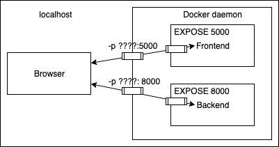

# Part 1 section 6: Utilizing tools from the Registry

The theory for the following exercises is presented at https://devopswithdocker.com/part-1/section-3.

## Exercise 1.11: Spring

> Create a Dockerfile for an old Java Spring project that can be found from the [course repository](https://github.com/docker-hy/material-applications/tree/main/spring-example-project).
>
> The setup should be straightforward with the README instructions. Tips to get you started:
>
> Use [openjdk image](https://hub.docker.com/_/openjdk) `FROM openjdk:_tag_` to get Java instead of installing it manually. Pick the tag by using the README and Docker Hub page.
>
> You've completed the exercise when you see a 'Success' message in your browser.
>
> Submit the Dockerfile you used to run the container.
>
> Source: https://devopswithdocker.com/part-1/section-6/#exercises-111-114

## Exercises 1.12-1.14

> The following three exercises will start a larger project that we will configure in parts 2 and 3. They will require you to use everything you've learned up until now. If you need to modify a Dockerfile in some later exercises, feel free to do it on top of the Dockerfiles you create here.
>
> Source: https://devopswithdocker.com/part-1/section-6/#exercises-111-114

## Exercise 1.12: Hello, frontend!

> A good developer creates well-written READMEs. Such that they can be used to create Dockerfiles with ease.
>
> Clone, fork or download the project from
> [https://github.com/docker-hy/material-applications/tree/main/example-frontend](https://github.com/docker-hy/material-applications/tree/main/example-frontend).
>
> Create a Dockerfile for the project (example-frontend) and give a command so that the project runs in a Docker container with port 5000
> exposed and published so when you start the container and navigate to [http://localhost:5000](http://localhost:5000)
> you will see message if you're successful.
> * note that the port 5000 is reserved in the more recent OSX versions (Monterey, Big Sur), so you have to use some other host port
>
> _As in other exercises, do not alter the code of the project_
>
> * TIP: The project has install instructions in README.
>
> * TIP: Note that the app starts to accept connections when "Accepting connections at http://localhost:5000" has been printed to the screen, this takes a few seconds
>
> * TIP: You do not have to install anything new outside containers.
>
> Source: https://devopswithdocker.com/part-1/section-6/#exercises-111-114

**Save your solution for this exercise in the file [frontend.Dockerfile](./frontend.Dockerfile).**

## Exercise 1.13: Hello, backend!

> Clone, fork or download a project from
> [https://github.com/docker-hy/material-applications/tree/main/example-backend](https://github.com/docker-hy/material-applications/tree/main/example-backend).
>
> Create a Dockerfile for the project (example-backend). Start the container with port 8080 published.
>
> When you start the container and navigate to [http://localhost:8080/ping](http://localhost:8080/ping) you should get a "pong" as response.
>
> _Do not alter the code of the project_
>
> Source: https://devopswithdocker.com/part-1/section-6/#exercises-111-114

**Save your solution for this exercise in the file [backend.Dockerfile](./backend.Dockerfile). Also, save the command you used to start the container in the file [ex-1-13.txt](./ex-1-13.txt).**

## Exercise 1.14: Environment

> Start both frontend-example and backend-example with correct ports exposed and add ENV to Dockerfile with necessary information from both READMEs
> ([front](https://github.com/docker-hy/material-applications/tree/main/example-frontend), [back](https://github.com/docker-hy/material-applications/tree/main/example-backend)).
>
> Ignore the backend configurations until frontend sends requests to `_backend_url_/ping` when you press the button.
>
> You know that the configuration is ready when the button for 1.14 of frontend-example responds and turns green.
>
> _Do not alter the code of either project_
>
> Submit the edited Dockerfiles and commands used to run.
>
> 
>
> The frontend will first talk to your browser. Then the code will be executed from your browser and that will send a message to backend.
>
> 
>
> * TIP: When configuring web applications keep browser developer console ALWAYS open, F12 or cmd+shift+I when the browser window is open. Information about configuring cross origin requests is in README of the backend project.
>
> * TIP: Developer console has multiple views, most important ones are Console and Network. Exploring the Network tab can give you a lot of information on where messages are being sent and what is received as response!
>
> Source: https://devopswithdocker.com/part-1/section-6/#exercises-111-114

## Extra exercises 1.15-1.16

## Exercise 1.15: Homework

> Create Dockerfile for an application or any other dockerised project in any of your own repositories and publish it to Docker Hub. This can be any project, except the clones or forks of backend-example or frontend-example.
>
> For this exercise to be complete you have to provide the link to the project in Docker Hub, make sure you at least have a basic description and instructions for how to run the application in a [README](https://help.github.com/en/articles/about-readmes) that's available through your submission.
>
> https://devopswithdocker.com/part-1/section-6/#exercises-115-116

There are no automated tests for this extra exercise. You don't need to submit anything, but if you wish, you can add a new file with information about your Docker Hub experience.

## Exercise 1.16: Cloud deployment

> It is time to wrap up this part and run a containerized app in the cloud.
>
> You can take any web-app, eg. an example or exercise from this part, your own app, or even the course material (see [devopsdockeruh/coursepage](https://hub.docker.com/r/devopsdockeruh/coursepage)) and deploy it to some cloud provider.
>
> There are plenty of alternatives, and most provide a free tier. Here are some alternatives that are quite simple to use:
>
> - [fly.io](https://fly.io) (easy to use but needs a credit card even in the free tier)
> - [render.com](https://render.com) (bad documentation, you most likely need google)
> - [heroku.com](https://heroku.com) (has a free student plan through [GitHub Student Developer Pack](https://www.heroku.com/github-students))
>
> If you know a good cloud service for the purposes of this exercise, please tell us (yes, we know about Amazon AWS, Google Cloud and Azure already... ).
>
> Submit the Dockerfile, a brief description of what you did, and a link to the running app.
>
> Source: https://devopswithdocker.com/part-1/section-6/#exercises-115-116

There are no automated tests for this extra exercise. You don't need to submit anything, but if you wish, you can add a new file with information about your deployment experience.
